# Lost&Found Luanda — Documento Técnico

**Índice**

1. Introdução ao projeto ........................................... Página 1
2. Objetivos ....................................................... Página 2
3. Escopo ......................................................... Página 2
4. Requisitos Funcionais .......................................... Página 3
5. Requisitos Não Funcionais ...................................... Página 4
6. Regras de Negócio .............................................. Página 5
7. Atores do Sistema .............................................. Página 6
8. Diagrama de Contexto ........................................... Página 7
9. Diagrama de Casos de Uso ...................................... Página 8
10. Especificação resumida dos Casos de Uso ....................... Página 10
11. Diagrama de Classes de Domínio ................................. Página 13
12. Diagrama Entidade-Relacionamento (ER) ........................ Página 14
13. Diagramas de Sequência das funcionalidades principais .......... Página 15
14. Diagramas de Atividade ....................................... Página 18
15. Diagrama de Estados do anúncio ................................ Página 20
16. Arquitetura do Sistema (C4 - Contexto e Containers) ............ Página 21

---

## 1. Introdução ao projeto {#introducao}

**Lost&Found Luanda** é uma plataforma comunitária para registar, procurar e gerir objetos perdidos e encontrados na cidade de Luanda. O sistema permite que utilizadores públicos publiquem ocorrências, encontrem correspondências e contactem-se de forma simples, enquanto equipa administrativa valida e modera conteúdos.

O produto visa melhorar a recuperação de itens perdidos através de uma experiência digital orientada para o utilizador, combinada com moderação e suporte administrativo.

---

## 2. Objetivos {#objetivos}

- Facilitar a publicação rápida de ocorrências de objetos perdidos, encontrados e avisos de encontro.
- Aumentar a taxa de correspondência entre objetos perdidos e encontrados com base em categoria, localização e características.
- Permitir comunicação segura entre autores de ocorrências.
- Oferecer painéis distintos para utilizadores e administradores com visibilidade e controlo apropriados.
- Garantir que os conteúdos publicados são moderados, com suporte a denúncias e aprovação administrativa.

---

## 3. Escopo {#escopo}

### Dentro do escopo

- Publicação de ocorrências com tipo (`perdido`, `encontrado`, `aviso`).
- Listagem de objetos perdidos, encontrados e avisos.
- Detalhe de ocorrência com imagens, localização e contactos.
- Autenticação de utilizadores e administração de sessão.
- Área privada do utilizador com ocorrências próprias, favoritos, mensagens, notificações e perfil.
- Painel administrativo para gerir ocorrências, avisos, utilizadores, municípios, categorias, denúncias e configurações.
- Sistema de notificações de correspondência e atualizações de ocorrências.

### Fora do escopo

- Processamento real de pagamentos.
- Integração com sistemas externos de autoridades policiais.
- Implementação de backend completa em produção.
- Processamento automático de imagens ou geolocalização além do formulário de localização textual.

---

## 4. Requisitos Funcionais {#requisitos-funcionais}

1. O sistema deve permitir a publicação de ocorrências com informação de tipo, categoria, descrição, localização e contactos.
2. O sistema deve distinguir entre ocorrências `perdido`, `encontrado` e `aviso`.
3. O sistema deve oferecer navegação separada para listas de objetos perdidos, encontrados e avisos.
4. O sistema deve permitir acesso autenticado à área do utilizador (`/meu-espaco`).
5. O sistema deve permitir que utilizadores façam login como `utilizador` ou `admin`.
6. O sistema deve proteger as rotas administrativas (`/admin`) para perfis de administrador.
7. O sistema deve exibir correspondências sugeridas de ocorrências semelhantes na página de detalhe.
8. O sistema deve permitir que o utilizador visualize as suas ocorrências publicadas, favoritos, mensagens, notificações e perfil.
9. O sistema deve permitir que o administrador filtre e valide ocorrências e gerencie denúncias.
10. O sistema deve permitir ao administrador gerir utilizadores, categorias, municípios e configurações de moderação.
11. O sistema deve registrar notificações de atividade e correspondência para o utilizador.
12. O sistema deve suportar upload de imagens para a publicação de ocorrências.
13. O sistema deve exibir um resumo da plataforma na página inicial com estatísticas e avisos.

---

## 5. Requisitos Não Funcionais {#requisitos-nao-funcionais}

- **Usabilidade**: interface clara, navegação simples e etapas orientadas para publicação.
- **Performance**: carregamento responsivo das páginas e filtros de listagem eficientes.
- **Segurança**: controle de acesso por papel e proteção de rotas administrativas.
- **Escalabilidade**: arquitetura preparada para adicionar serviços de backend e persistência.
- **Manutenibilidade**: separação de responsabilidades entre domínio, apresentação e autenticação.
- **Compatibilidade**: suporte a desktop e mobile com design responsivo.
- **Disponibilidade**: serviço acessível para utilização contínua pela comunidade.
- **Localização**: interface e textos centrados no português de Angola.
- **Auditoria**: registro de atividade do utilizador e das ações de moderação.

---

## 6. Regras de Negócio {#regras-de-negocio}

- Apenas utilizadores autenticados podem aceder a `/meu-espaco`.
- Apenas administradores podem aceder a `/admin`.
- Novas ocorrências podem iniciar em estado `em_analise` quando a moderação manual estiver habilitada.
- O estado padrão de uma ocorrência publicada é `ativo`.
- Uma ocorrência pode evoluir de `em_analise` para `ativo`, `resolvido` ou `arquivado`.
- O sistema sugere correspondências com base em categoria, local e características textuais.
- Apenas ocorrências de tipo `encontrado` ou `perdido` geram correspondências diretas.
- Avisos são publicados como conteúdo público de aviso de encontro e podem ser moderados separadamente.
- Denúncias de utilizadores podem suspender ou ocultar ocorrências até revisão.
- Utilizadores podem marcar ocorrências como favoritos para acompanhar possíveis correspondências.
- Mensagens entre utilizadores são usadas para combinar a devolução do objeto.
- As configurações administrativas controlam sensibilidade de correspondência e regras de moderação.

---

## 7. Atores do Sistema {#atores}

- **Utilizador**: pessoa que publica ocorrências, consulta listas e interage com correspondências.
- **Administrador**: pessoa responsável por validar ocorrências, moderar conteúdo, gerir utilizadores e ajustar configurações.
- **Visitante**: pessoa não autenticada que pesquisa ocorrências no site.
- **Sistema de Notificações**: mecanismo interno que envia avisos ao utilizador sobre matching e atualizações.

---

## 8. Diagrama de Contexto {#diagrama-contexto}

Este diagrama mostra os atores que interagem com o sistema e as fronteiras do produto.

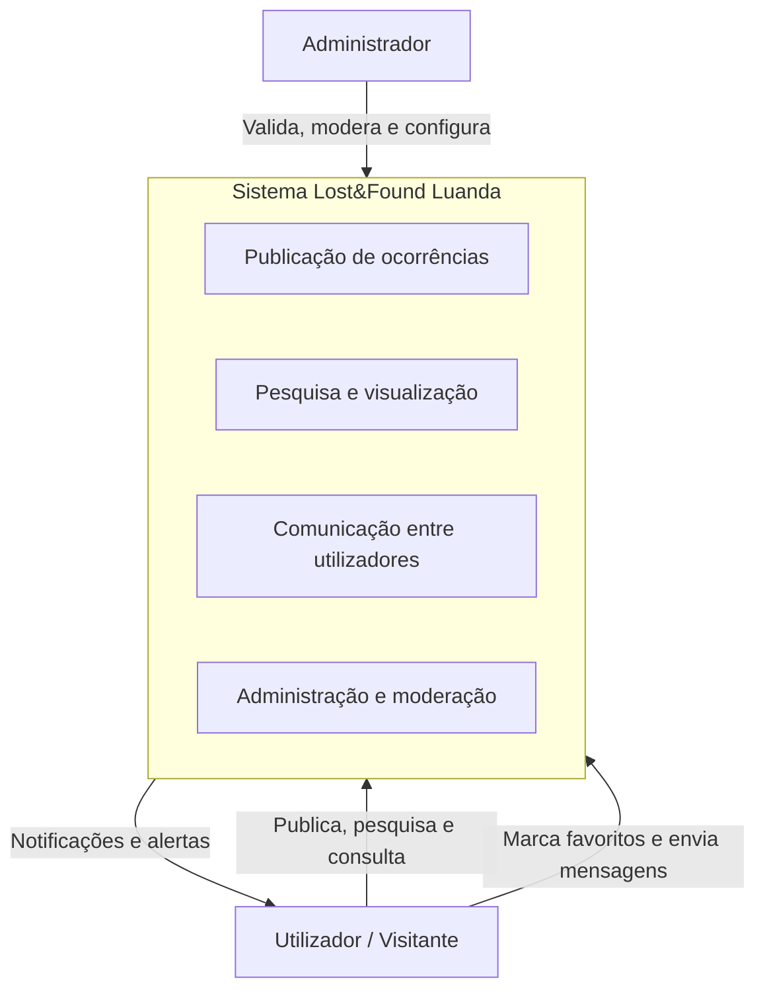

Explicação: o sistema atende dois perfis principais, fornecendo interface pública e privada e expondo funcionalidades administrativas.

---

## 9. Diagrama de Casos de Uso {#diagrama-casos-uso}

O diagrama de casos de uso identifica as funcionalidades oferecidas a cada ator.

```mermaid
usecaseDiagram
  actor Visitante as V
  actor Utilizador as U
  actor Administrador as A

  V --> (Pesquisar ocorrências)
  V --> (Ver detalhe da ocorrência)

  U --> (Entrar na plataforma)
  U --> (Publicar ocorrência)
  U --> (Ver minhas ocorrências)
  U --> (Ver favoritos)
  U --> (Enviar mensagem)
  U --> (Receber notificações)
  U --> (Ver perfil)

  A --> (Gerir ocorrências)
  A --> (Aprovar ou rejeitar ocorrências)
  A --> (Gerir denúncias)
  A --> (Gerir utilizadores)
  A --> (Configurar plataforma)

  (Aprovar ou rejeitar ocorrências) ..> (Gerir ocorrências)
  (Gerir denúncias) ..> (Gerir ocorrências)
```

Explicação: visitantes podem pesquisar e ver detalhes; utilizadores autenticados acompanham ocorrências e comunicam; administradores controlam a integridade e configuração do sistema.

---

## 10. Especificação resumida dos Casos de Uso {#especificacao-casos-uso}

### UC1 — Publicar Ocorrência
- **Ator principal**: Utilizador
- **Pré-condição**: Utilizador autenticado ou público com acesso guiado.
- **Fluxo principal**:
  1. Selecionar tipo de ocorrência (`perdido`, `encontrado`, `aviso`).
  2. Preencher título, categoria, descrição e características.
  3. Informar localização, município e data.
  4. Fazer upload de imagens.
  5. Inserir contactos (telefone, WhatsApp, email).
  6. Submeter ocorrência.
- **Pós-condição**: ocorrência criada e visível ou enviada para moderação.
- **Notas**: o sistema exibe barra de progresso por etapas.

### UC2 — Pesquisar e Filtrar Ocorrências
- **Ator principal**: Visitante / Utilizador
- **Pré-condição**: sistema disponível.
- **Fluxo principal**:
  1. Aceder à página de listagem de `perdidos`, `encontrados` ou `avisos`.
  2. Utilizar barra de pesquisa e categorias.
  3. Visualizar cartões de ocorrência.
  4. Selecionar ocorrência para ver detalhe.
- **Pós-condição**: itens relevantes exibidos ao utilizador.
- **Notas**: filtros podem incluir categoria e município.

### UC3 — Ver Detalhe de Ocorrência
- **Ator principal**: Visitante / Utilizador
- **Pré-condição**: existência de ocorrência.
- **Fluxo principal**:
  1. Abrir página de detalhe de ocorrência.
  2. Visualizar imagens, descrição, localização e estado.
  3. Ver contactos do autor.
  4. Consultar possíveis correspondências.
- **Pós-condição**: ator obtém informação completa sobre a ocorrência.

### UC4 — Aceder à Área do Utilizador
- **Ator principal**: Utilizador
- **Pré-condição**: utilizador autenticado.
- **Fluxo principal**:
  1. Login no sistema.
  2. Navegar para `/meu-espaco`.
  3. Visualizar dashboard com estatísticas.
  4. Navegar para ocorrências, favoritos, mensagens, notificações ou perfil.
- **Pós-condição**: utilizador tem visão pessoal das ocorrências e interações.

### UC5 — Gerir Ocorrências pelo Administrador
- **Ator principal**: Administrador
- **Pré-condição**: autenticado como admin.
- **Fluxo principal**:
  1. Aceder ao painel `/admin/ocorrencias`.
  2. Filtrar e pesquisar ocorrências.
  3. Rever ocorrências e alterar status.
  4. Apagar ou aprovar publicações.
- **Pós-condição**: estado de ocorrências atualizado e conteúdo moderado.

### UC6 — Tratar Denúncias
- **Ator principal**: Administrador
- **Pré-condição**: denúncia recebida.
- **Fluxo principal**:
  1. Aceder a `/admin/denuncias`.
  2. Ler detalhes da denúncia.
  3. Rever ocorrência alvo.
  4. Resolver denúncia e aplicar ação.
- **Pós-condição**: denúncia marcada e ocorrência avaliada.

### UC7 — Notificar Utilizador sobre Correspondência
- **Ator principal**: Sistema de Notificações
- **Pré-condição**: nova correspondência identificada.
- **Fluxo principal**:
  1. Detectar coincidência entre ocorrências.
  2. Gerar notificação.
  3. Exibir na área de notificações do utilizador.
- **Pós-condição**: utilizador recebe aviso de correspondência.

### UC8 — Enviar Mensagem entre Utilizadores
- **Ator principal**: Utilizador
- **Pré-condição**: utilizador autenticado e ocorrência existente.
- **Fluxo principal**:
  1. Aceder à aba de mensagens.
  2. Selecionar conversação ou iniciar chat.
  3. Enviar mensagem.
  4. Receber resposta.
- **Pós-condição**: canal de comunicação criado ou atualizado.

---

## 11. Diagrama de Classes de Domínio {#diagrama-classes}

O diagrama de classes descreve as entidades principais e suas relações no domínio.

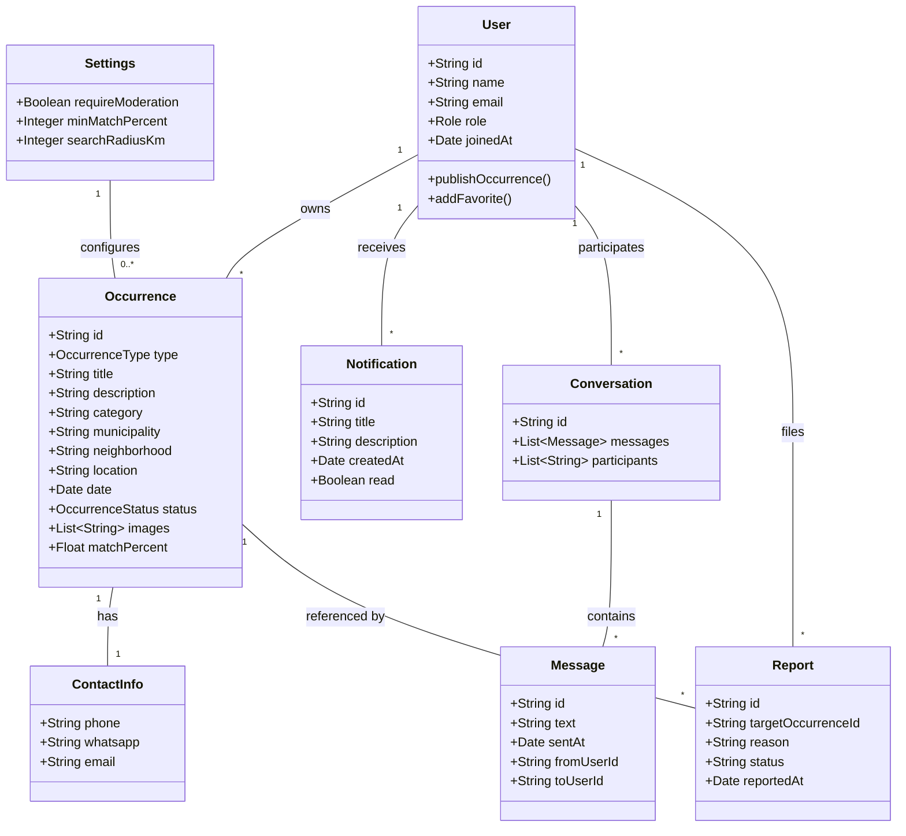

Explicação: `User` controla publicações e interações, `Occurrence` é o núcleo do domínio, `Notification` e `Conversation` suportam comunicação, e `Report` e `Settings` apoiam governança.

---

## 12. Diagrama Entidade-Relacionamento (ER) {#diagrama-er}

O modelo ER representa as tabelas e chaves estrangeiras que suportam o domínio.

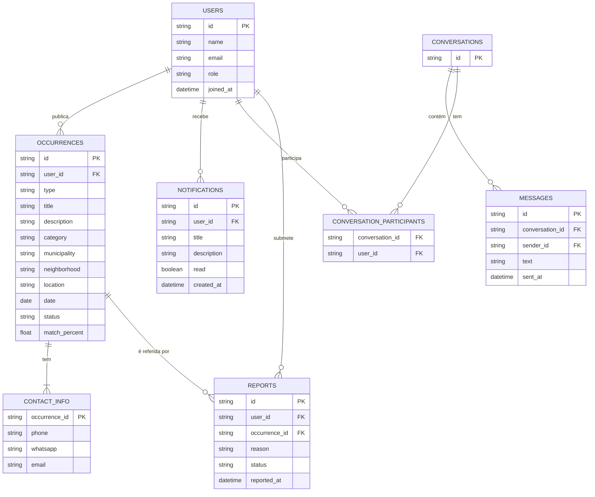

Explicação: o modelo ER foi desenhado para suportar identidade de utilizadores, ocorrências, mensagens e ação de denúncia.

---

## 13. Diagramas de Sequência das funcionalidades principais {#diagrama-sequencia}

### 13.1 Sequência: Publicar Ocorrência

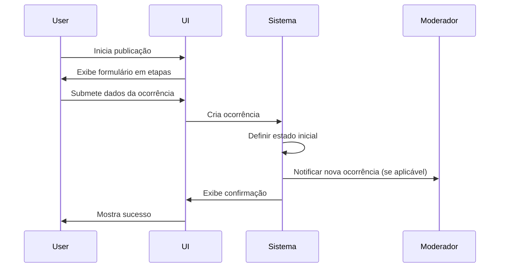

Explicação: o fluxo destaca a montagem do formulário, a criação de ocorrência e a notificação para moderação.

### 13.2 Sequência: Gerar correspondência e notificar utilizador

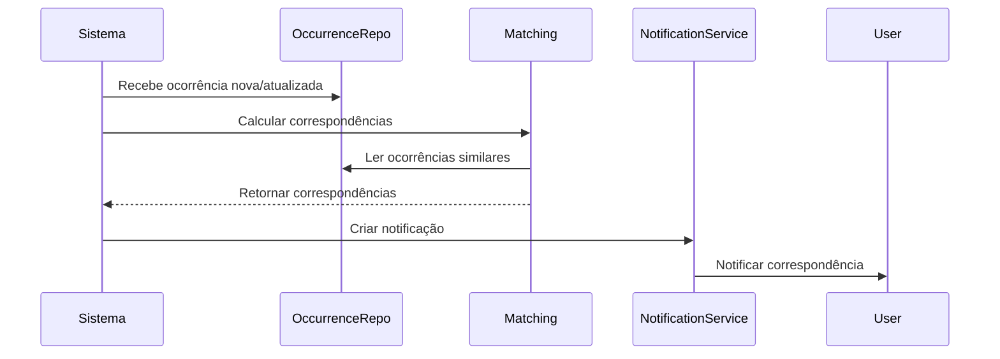

Explicação: o sistema compara ocorrências e gera notificações para avisar o utilizador sobre match.

### 13.3 Sequência: Administrador valida ocorrência

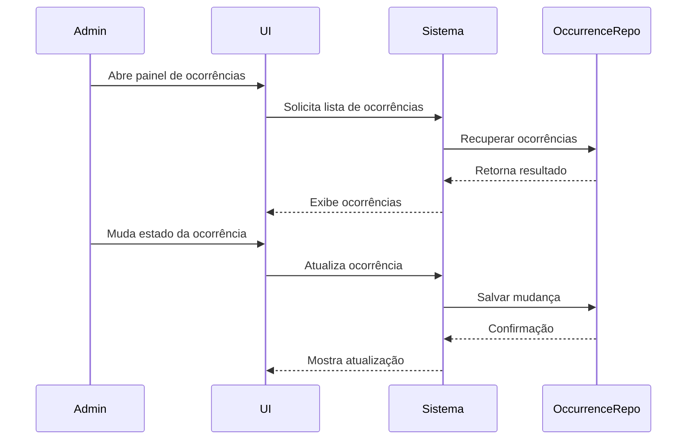

Explicação: mostra o loop de validação e alteração de estado do administrador.

---

## 14. Diagramas de Atividade {#diagramas-atividade}

### 14.1 Atividade: Fluxo de publicação de ocorrência

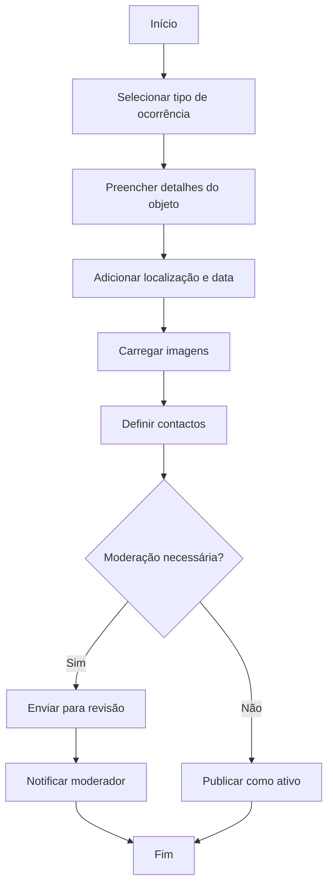

Explicação: a atividade cobre o processo guiado de publicação e a decisão de moderação.

### 14.2 Atividade: Fluxo de interação de utilizador autenticado

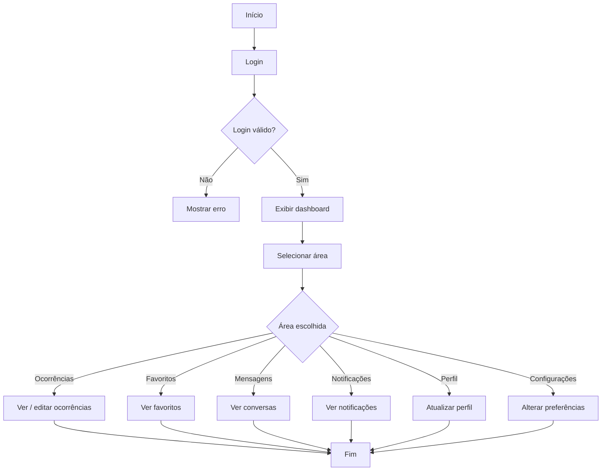

Explicação: mostra separação das principais áreas de conta e opções de navegação após login.

---

## 15. Diagrama de Estados do anúncio {#diagrama-estados}

A máquina de estados descreve os possíveis valores de `status` de uma ocorrência.

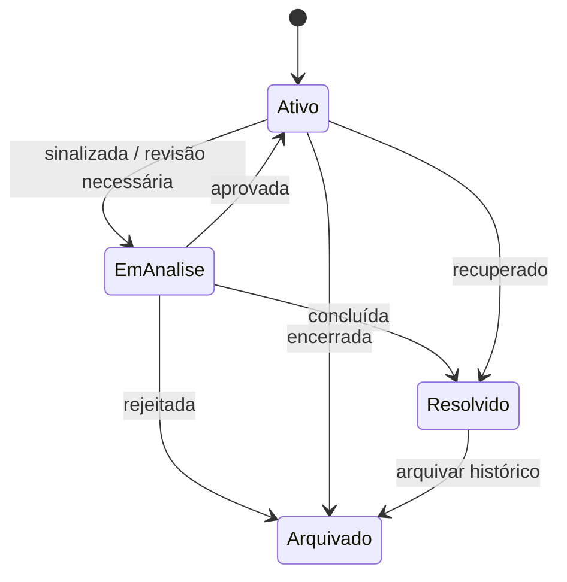

Explicação: o modelo de estados sustenta o ciclo de vida das ocorrências desde publicação até arquivamento.

---

## 16. Arquitetura do Sistema (C4 - Contexto e Containers) {#arquitetura}

### 16.1 C4 - Diagrama de Contexto

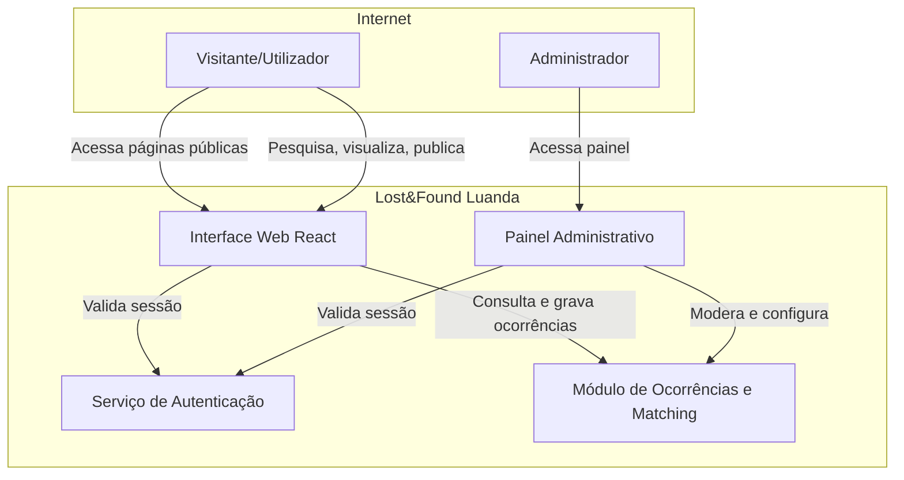

Explicação: o diagrama de contexto posiciona o sistema no ambiente de utilizadores e define as fronteiras do produto.

### 16.2 C4 - Diagrama de Containers

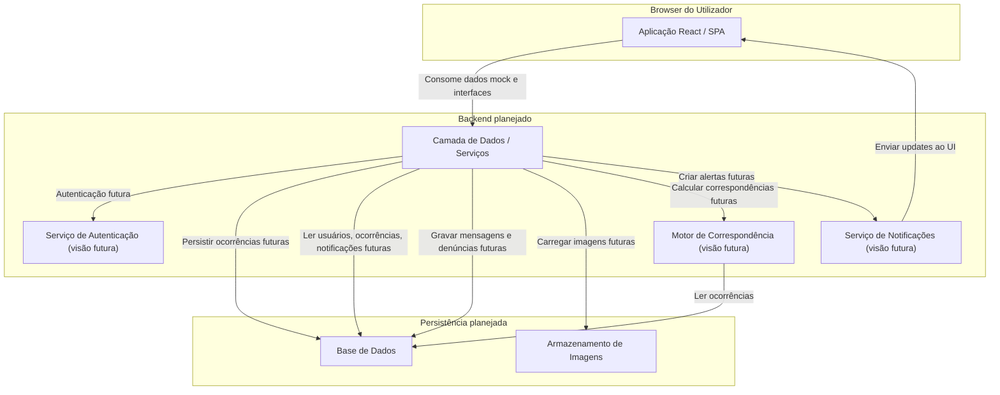

Explicação: o container descreve a visão futura de backend e persistência a partir da perspectiva do frontend atual.

### Observações de arquitetura

- A camada de apresentação é implementada como SPA React/TanStack.
- O frontend atual usa dados mock e autenticação local simulada.
- O diagrama de containers apresenta a arquitetura esperada quando o backend for implementado.
- O domínio central no frontend suporta publicação, listagem, detalhe de ocorrências e áreas de utilizador e admin.
- Os serviços de notificação e matching são referências de visão futura; hoje a aplicação usa listas e filtros de frontend.

---

**Fim do documento técnico.**
